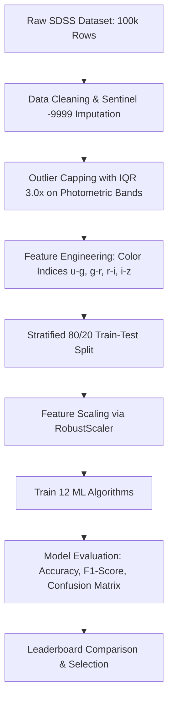

# 🌌 SDSS Star, Galaxy & Quasar (QSO) Classification

[](https://www.python.org/)
[](https://scikit-learn.org/)
[](https://xgboost.readthedocs.io/)
[](https://lightgbm.readthedocs.io/)
[](https://opensource.org/licenses/MIT)

An end-to-end Machine Learning pipeline for multi-class classification of astronomical objects from the **Sloan Digital Sky Survey (SDSS Data Release 17)**. The goal is to accurately distinguish between **Galaxies**, **Stars**, and **Quasars (QSOs)** using photometric measurements and spectroscopic redshift.

---

## 📌 Table of Contents
- [Project Overview](#-project-overview)
- [Dataset Summary](#-dataset-summary)
- [Project Architecture & Workflow](#-project-architecture--workflow)
- [Data Preprocessing & Feature Engineering](#-data-preprocessing--feature-engineering)
- [Model Comparison & Benchmark](#-model-comparison--benchmark)
- [Key Scientific & ML Insights](#-key-scientific--ml-insights)
- [Installation & Quickstart](#-installation--quickstart)
- [Repository Structure](#-repository-structure)
- [Technologies Used](#-technologies-used)
- [Author & Acknowledgments](#-author--acknowledgments)

---

## 🔭 Project Overview

Astronomical surveys capture millions of celestial observations. Manually inspecting every object is impossible, making automated Machine Learning classification essential.

* **Target Classes**:
  * `GALAXY`: Extended stellar systems containing billions of stars.
  * `STAR`: Individual stars located primarily within our Milky Way galaxy.
  * `QSO` (Quasar / Quasi-Stellar Object): Extremely distant, luminous active galactic nuclei powered by supermassive black holes.
* **Core Challenge**: Resolving class overlaps in broadband photometric filters and handling astronomical measurement artifacts.
* **Top Result**: **98.03% Accuracy** & **0.9802 Weighted F1-Score** using an Ensemble **Bagging Classifier**.

---

## 📊 Dataset Summary

The dataset comprises **100,000 celestial observations** with 18 initial features:

| Feature Category | Features | Description | Action Taken |
| :--- | :--- | :--- | :--- |
| **Identifiers** | `obj_ID`, `spec_obj_ID`, `run_ID`, `rerun_ID`, `cam_col`, `field_ID`, `plate`, `MJD`, `fiber_ID` | Administrative telescope metadata & catalog IDs | **Dropped** (no physical relevance) |
| **Coordinates** | `alpha` (RA), `delta` (Dec) | Celestial coordinates (East-West / North-South positions) | Retained |
| **Photometry** | `u`, `g`, `r`, `i`, `z` | Atmospheric passband magnitudes (Ultraviolet, Green, Red, Near-IR, IR) | Capped & engineered |
| **Spectroscopy** | `redshift` | Speed at which the object recedes due to cosmic expansion | **Primary predictor** |
| **Target** | `class` | Object category: `GALAXY`, `STAR`, or `QSO` | Label Encoded (0, 1, 2) |

### Class Distribution
* **GALAXY**: 59,445 (59.4%)
* **STAR**: 21,594 (21.6%)
* **QSO**: 18,961 (19.0%)

---

## 🛠️ Project Architecture & Workflow



---

## 🔬 Data Preprocessing & Feature Engineering

1. **Sentinel Imputation**:
   * Resolved `-9999` error values caused by photometric measurement failures by replacing them with the band's median.
2. **Astronomical Outlier Capping (IQR Winsorization)**:
   * Applied a conservative $3.0 \times \text{IQR}$ threshold to the photometric bands (`u`, `g`, `r`, `i`, `z`) to remove sensor distortions while preserving real distribution tails.
   * **Note:** `redshift` was intentionally **not capped** because ultra-high values are physically valid for distant Quasars.
3. **Color Index Feature Engineering**:
   * Calculated spectral color gradients ($u - g$, $g - r$, $r - i$, $i - z$).
   * Color indices capture the spectral energy distribution (SED) and slope, providing stronger separation than raw magnitudes alone.
4. **Robust Scaling**:
   * Used `RobustScaler` (median & IQR) to scale numerical features for distance-based models (KNN, SVM, Logistic Regression, Neural Networks) without data leakage.

---

## 🏆 Model Comparison & Benchmark

All 12 models were evaluated on the identical **20,000 unseen test samples** with stratified splits:

| Rank | Model | Type | Accuracy (%) | F1-Score (Weighted) | Key Strength |
| :---: | :--- | :--- | :---: | :---: | :--- |
| 🥇 | **Bagging Classifier** | Ensemble | **98.03%** | **0.9802** | Best overall variance reduction |
| 🥈 | **LightGBM** | Boosting | **97.96%** | **0.9795** | Ultra-fast leaf-wise tree growth |
| 🥉 | **Random Forest** | Ensemble | **97.93%** | **0.9792** | Robust against noisy features |
| 4 | **XGBoost** | Boosting | **97.84%** | **0.9783** | Strong second-order gradient boosting |
| 5 | **Extra Trees** | Ensemble | **97.47%** | **0.9746** | Extremely randomized thresholds |
| 6 | **Decision Tree** | Tree | **97.36%** | **0.9735** | Highly interpretable decision rules |
| 7 | **ANN (MLP Classifier)** | Neural Net | **97.23%** | **0.9721** | 2-layer MLP (128 → 64 ReLU neurons) |
| 8 | **Logistic Regression** | Linear | **95.88%** | **0.9584** | Fast, solid linear baseline |
| 9 | **KNN ($k=5$)** | Instance | **95.23%** | **0.9523** | Effective localized clustering |
| 10 | **SVM (LinearSVC)** | Kernel/Linear| **94.14%** | **0.9413** | Maximizes hyperplane margins |
| 11 | **Naive Bayes (Gaussian)**| Probabilistic| **92.95%** | **0.9311** | Near-instant probabilistic baseline |
| 12 | **AdaBoost** | Boosting | **74.88%** | **0.7626** | Underfitted due to single-split stumps |

---

## 💡 Key Scientific & ML Insights

1. **`redshift` is the Dominant Predictor**:
   * Accounts for over **50.5% feature importance**.
   * Stars are located within our galaxy ($\text{redshift} \approx 0$).
   * Galaxies have moderate cosmological redshift ($0 < z < 0.5$).
   * Quasars (QSOs) exhibit massive redshifts ($z > 1.0$ to $7.0$) due to extreme distances.
2. **Ensemble Models Dominate Tabular Astronomical Data**:
   * Bagging, LightGBM, and Random Forest achieved $>97.9\%$ accuracy.
3. **Feature Engineering Adds Measurable Gain**:
   * Adding color index differences ($u-g, g-r, r-i, i-z$) resolved multi-band magnitude collinearity ($r > 0.90$) and boosted classifier performance across all models.

---

## 🚀 Installation & Quickstart

### 1. Clone the repository
```bash
git clone https://github.com/your-username/sdss-star-galaxy-qso-classification.git
cd sdss-star-galaxy-qso-classification
```

### 2. Set up Python environment
```bash
# Using standard venv
python -m venv .venv

# Activate on Windows
.\.venv\Scripts\Activate.ps1

# Activate on Linux/macOS
source .venv/bin/activate
```

### 3. Install dependencies
```bash
pip install -r requirements.txt
```

### 4. Run the Jupyter Notebook
```bash
jupyter notebook "star_classification_notebook (1).ipynb"
```

---

## 📁 Repository Structure

```text
├── star_classification_notebook (1).ipynb   # Main end-to-end ML notebook
├── star_classification.csv                  # SDSS 100k dataset
├── requirements.txt                         # Exact Python dependencies
└── README.md                                # Comprehensive project documentation
```

---

## 🧰 Technologies Used

* **Language**: Python 3.10+
* **Data Processing**: Pandas, NumPy
* **Data Visualization**: Matplotlib, Seaborn
* **Machine Learning**: Scikit-Learn, XGBoost, LightGBM
* **Environment**: Jupyter Notebook / Google Colab

---

## 📜 License

Distributed under the **MIT License**. See `LICENSE` for details.
